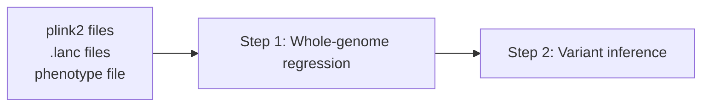

# lagga CLI

`lagga` provides a command-line interface for running local-ancestry-aware GWAS.
The whole-genome regression and single variant tests can be performed in
**two steps** (`step1`, `step2`) or in a **single pipeline** (`all-steps`).

---

## Workflow Overview



## Basic Usage

To get help, use the `--help` flag:

```bash
lagga --help
lagga step2 --help
```

### Examples
A typical `lagga` run may look like:

```bash
lagga all-steps \
  --plink-prefix tests/data/chr20,tests/data/chr21,tests/data/chr22 \
  --lanc-file tests/data/chr20.lanc,tests/data/chr21.lanc,tests/data/chr22.lanc \
  --pheno-file tests/data/pheno.tsv \
  --covar-file tests/data/covar.tsv \
  --out-prefix example_chr20,example_chr21,example_chr22 \
  --variant-file1 tests/data/variants.txt \
  --trait-type qt
```

Alternatively, steps 0/1 and 2 can be performed separately:

```bash
lagga step1 \
  --plink-prefix tests/data/chr20,tests/data/chr21,tests/data/chr22 \
  --lanc-file tests/data/chr20.lanc,tests/data/chr21.lanc,tests/data/chr22.lanc \
  --pheno-file tests/data/pheno.tsv \
  --covar-file tests/data/covar.tsv \
  --out-prefix step1_preds \
  --variant-file tests/data/variants.txt \
  --trait-type qt

lagga step2 \
  --plink-prefix tests/data/chr20,tests/data/chr21,tests/data/chr22 \
  --lanc-file tests/data/chr20.lanc,tests/data/chr21.lanc,tests/data/chr22.lanc \
  --pheno-file tests/data/pheno.tsv \
  --covar-file tests/data/covar.tsv \
  --step1-prefix step1_preds \
  --out-prefix example_chr20,example_chr21,example_chr22 \
  --trait-type qt
```

---

## File Formats

### Inputs

#### Genotype

#### Local Ancestry

#### Phenotype

### Outputs

#### Step 1 Intermediate

#### Step 2 Results

---

## Options
### Global Options

These options are common to the `step1`, `step2`, and `all-steps` commands.


| Option      | Argument | Type | Description |
| --- | --- | --- | --- |
| `--plink-prefix` | TEXT | required | Plink2 file prefix(es), comma-separated |
| `--lanc-file` | TEXT | required | Local ancestry .lanc file(s), comma-separated |
| `--pheno-file` | TEXT | required | Phenotype file |
| `--ancestries` | TEXT | optional | Ordered ancestry names, comma-separated |
| `--covar-file` | TEXT | optional | Covariates file |
| `--samples-file` | TEXT | optional | Samples file |
| `--trait-type` | TEXT | optional | Trait type: quantitative (qt) or binary (bt) [default: qt] |


### Step 1 Options

These are the non-global options for `step1`:

| Option      | Argument | Type | Description |
| --- | --- | --- | --- |
| `--out-prefix` | TEXT | required | Step 1 predictions will be serialized and written to prefix.pkl |
| `--variant-file` | TEXT | optional| File with variants to include, one per line |
| `--h2-prior` | TEXT | optional | SNP heritability priors, comma-separated [default: 0.01,0.255,0.5,0.745,0.99] |
| `--block-size` | INTEGER | optional | Number of variants per block [default: 2000] |
| `--seed` | INTEGER | optional | Random seed [default: 100] |
| `--loocv` |   | optional | Use leave-one-out cross-validation (only for rare binary traits) [default: no-loocv] |


### Step 2 Options

These are the non-global options for `step2`:

| Option      | Argument | Type | Description |
| --- | --- | --- | --- |
| `--out-prefix` | TEXT | required | Output prefix(es), comma-separated, one per plink_prefix [required] |
| `--variant-file` | TEXT | optional| File with variants to include, one per line |
| `--block-size` | INTEGER | optional | Number of variants per block [default: 1000] |
| `--min-ac` | INTEGER | optional | Minimum allele count [default: 1] |


### All Steps Options

These are the non-global options for `all-steps`


| Option      | Argument | Type | Description |
| --- | --- | --- | --- |
| `--out-prefix` | TEXT | required | Output prefix(es), comma-separated, one per plink_prefix [required] |
| `--variant-file1` | TEXT | optional| File with variants to include for step 0/1, one per line |
| `--variant-file2` | TEXT | optional| File with variants to include for step 2, one per line |
| `--block-size0` | INTEGER | optional | Number of variants per block in step 0 [default: 2000] |
| `--block-size2` | INTEGER | optional | Number of variants per block in step 2 [default: 1000] |
| `--min-ac` | INTEGER | optional | Minimum allele count [default: 1] |
| `--seed` | INTEGER | optional | Random seed [default: 100] |
| `--loocv` |   | optional | Use leave-one-out cross-validation (only for rare binary traits) [default: no-loocv] |
