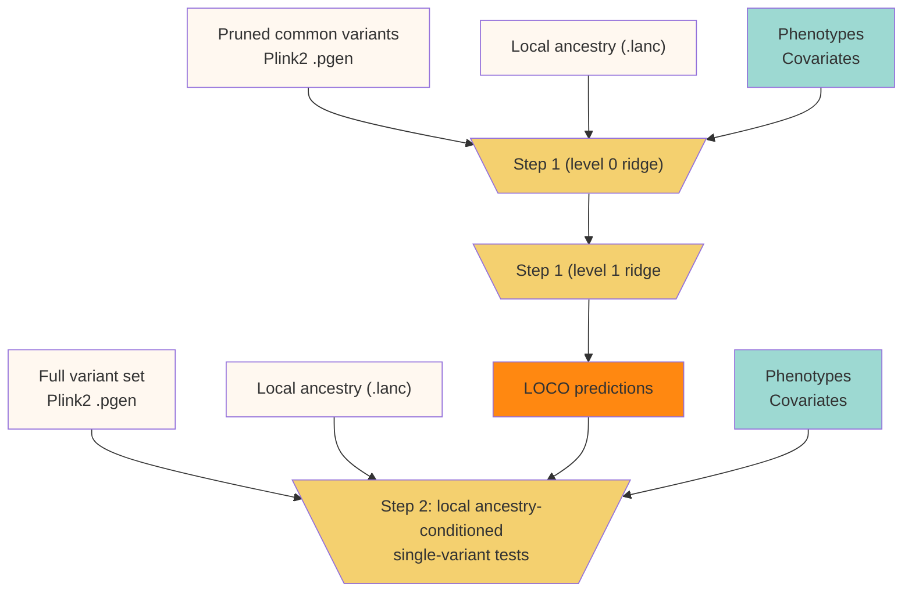
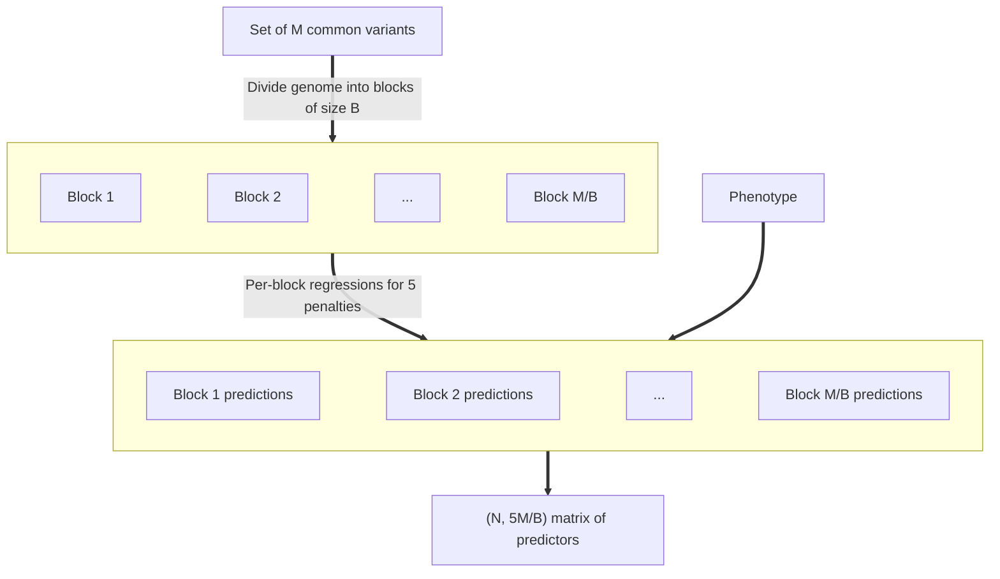
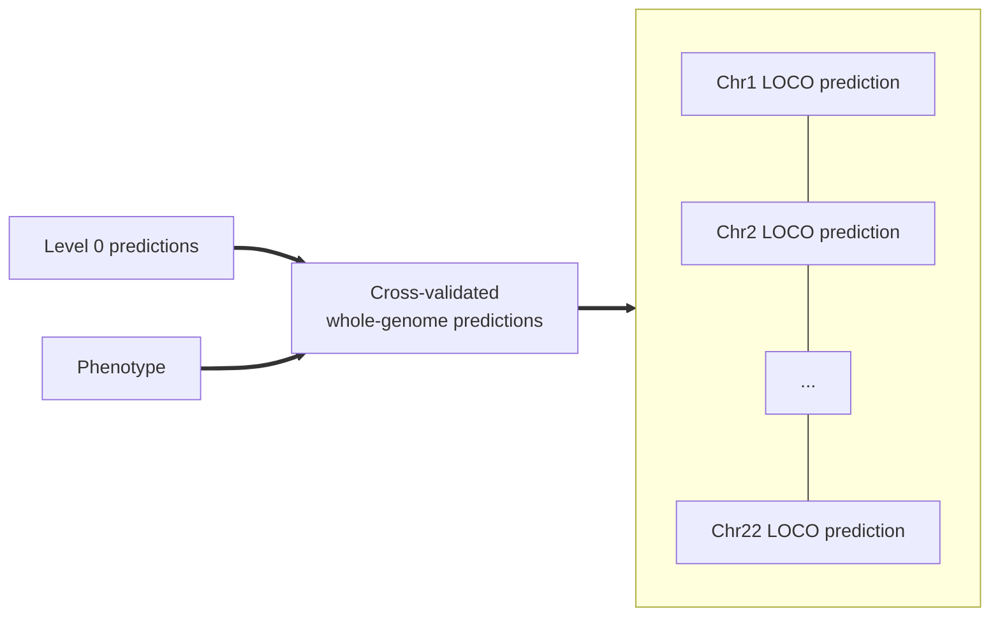

# Overview

**lagga** is a framework for conducting genome-wide association studies
in admixed individuals. Like [regenie](https://rgcgithub.github.io/regenie),
**lagga** uses whole-genome regression to capture polygenic effects and correct
for cryptic relatedness. Like [Tractor](https://atkinson-lab.github.io/Tractor-tutorial/),
**lagga** then calculates ancestry-specific effect estimates, conditioned
on local ancestry and whole-genome predictions. This two-step procedure is
described in greater detail below.

## lagga

### Step 1: Whole-Genome Regression

Step 1 of **lagga** closely follows the approach taken in **regenie**.
The goal here is to calculate leave-one-chromosome-out polygenic
scores using a reasonable subset of genetic markers. This is accomplished using
two layers of ridge regression. In the level 0 ridge regression, separate
regressions are performed using blocks of consecutive markers. This accounts
for linkage disequilibrium within blocks and yields a reduced set of genetic
predictors. In the level 1 ridge regression, the level 0 predictors are used
to calculate cross-validated whole-genome LOCO predictions for each phenotype.

#### Level 0 Ridge Regression

In level 0 of step 1, the genome is divided into blocks of consecutive SNPs
and ridge regression is used to generate per-block predictions.

First, a subset of $M$ (e.g. 500,000) variants is chosen to capture common
variation. Supposing block-size $B$ and sample size $N$, **lagga** reads
variants into $J=\lceil M/B \rceil$ blocks. For a given $N\times J$ block of
genotypes $G_B$ and $N\times 1$ phenotype $Y$, a series of ridge regressions is
performed for pre-specified penalties $\lambda_1, \lambda_2, \cdots, \lambda_A$:

$$\hat{Y}^{(a)}_B = G_B(G_B^TG_B + \lambda_a I_B)^{-1}G_B^TY$$

These block-specific predictors are aggregated to obtain
a $N\times JA$ set of genome-wide predictors, $W$:

$$W = \begin{pmatrix}\hat{Y}^{(1)}_1 & \cdots & \hat{Y}^{(A)}_1 & \cdots &  \hat{Y}^{(1)}_J & \cdots & \hat{Y}^{(A)}_J \end{pmatrix}$$

This procedure is followed for both quantitative and binary traits.
An $N\times C$ covariate matrix $X$ may be optionally supplied. In this case,
$X$ is regressed out of $Y$ and $G$, so that $Y$ and $G$ are
mean-centered and orthogonal to $X$. $Y$ and $G$ are additionally
standardized to have variance equal to 1.

#### Level 1 Ridge Regression

In level 1 of step 1, a second level of ridge regression is performed using the
predictions from level 0. Predictions are obtained for penalties
$\gamma_1, \cdots, \gamma_A$ and a final model is selected via cross-validation.

For quantitative traits, it is assumed that the phenotype $Y$ has been
residualized by $X$ and standardized as in level 0. For the model
$Y = W\beta + \epsilon$, we fit the following
ridge regression for each penalty $\gamma_a$.

$$\hat{\beta}^{(a)} = (W^TW + \lambda_a I_J)^{-1}W^TY$$

The optimal $\gamma_a$ is selected by minimizing mean-squared error with k-fold
cross-validation. For each chromosome $c$, a subset of predictors in $W$
corresponding to this chromosome, $W_c$ may be defined. Thus the
chromosome-specific predictor is given by the subset of coefficients $\hat{\beta}^{(a)}_c$.
A final set of leave-one-chromosome-out (LOCO) predictors is given by
$\begin{pmatrix}\hat{Y}_c\end{pmatrix}$, where:

$$\hat{Y}_c = W\hat{\beta}^{(a)}-W_c\hat{\beta}^{(a)}_c$$

For binary traits, logistic ridge regression is used to estimate
$\hat{\beta}^{(a)}$ in the model $\text{logit}(p) = \mu + W\beta$.
Here, $\hat{\mu}$ represents the effect on $Y$ from the covariates $X$
and is estimated separately using the logistic regression model
$\text{logit}(p) = \mu$. $\hat{\mu}$ is then provided as an un-penalized offset
in the logistic ridge regression model above.

The LOCO predictors (on the linear scale) are given as:

$$\hat{\eta}_c = \hat{\mu} + W\hat{\beta}^{(a)}-W_c\hat{\beta}^{(a)}_c$$

Here, the optional parameter $\gamma_a$ is selected by maximizing log-likelihood
with k-fold cross-validation. Optionally, leave-one-out cross-validation may
be used for rare phenotypes if specified by the user.

### Step 2: Single-Variant Tests

In step 2, variants are tested for association with phenotypes under several
possible models, depending on the user specification.

#### Quantitative Traits

For quantitative traits,
the associations are tested with respect to the residualized phenotype
$\tilde{Y} = Y - \hat{Y}_c$. In the following sections, we refer to this
residualized phenotype $\tilde{Y}$ as $Y$.

#### Binary Traits

For binary traits, the LOCO prediction
$\hat{\eta}_c$ is provided as an offset in logistic regression models of the form
$\text{logit}(p) = \hat{\eta}_c + Z\beta$.
