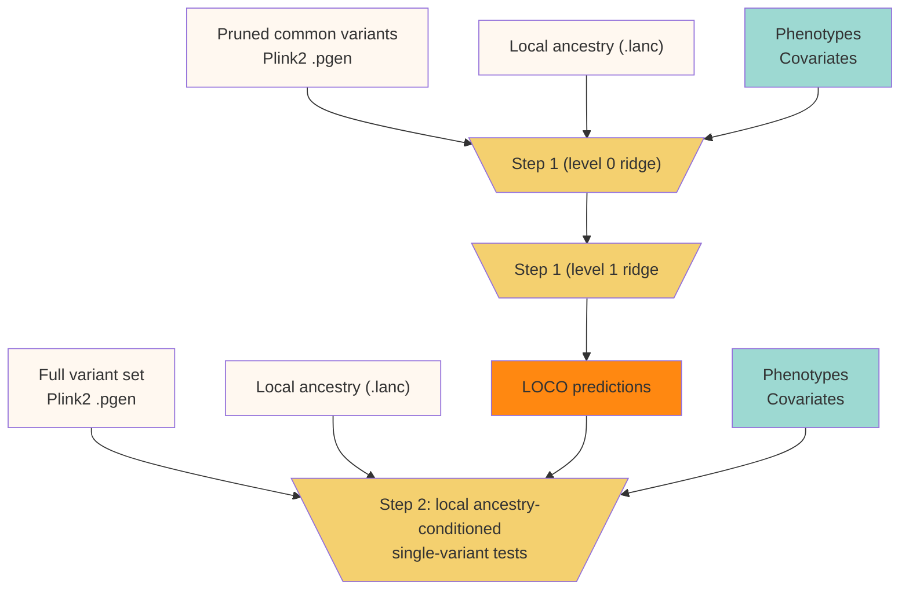
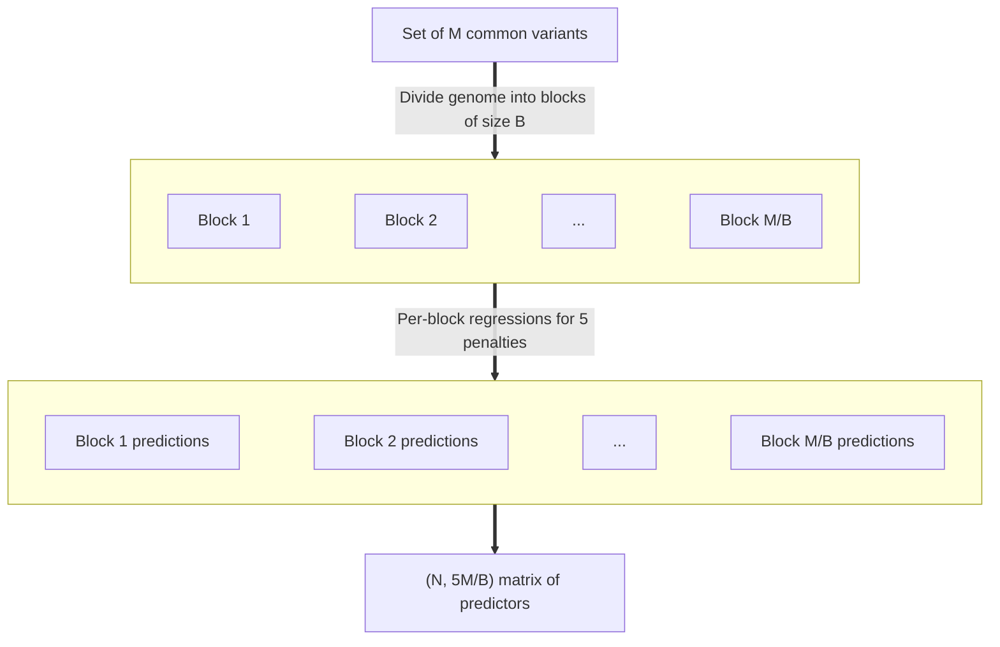

# Overview

**lagga** is a framework for conducting genome-wide association studies
in admixed individuals. Like [regenie](https://rgcgithub.github.io/regenie),
**lagga** uses whole-genome regression to capture polygenic effects and correct
for cryptic relatedness. Like [Tractor](https://atkinson-lab.github.io/Tractor-tutorial/),
**lagga** then calculates ancestry-specific effect estimates, conditioned
on local ancestry and whole-genome predictions. This two-step procedure is
described in greater detail below.

## lagga

### Step 1: whole-genome regression

Step 1 of **lagga** closely follows the approach taken in **regenie**.
The goal here is to calculate leave-one-chromosome-out polygenic
scores using a reasonable subset of genetic markers. This is accomplished using
two layers of ridge regression. In the level 0 ridge regression, separate
regressions are performed using blocks of consecutive markers. This accounts
for linkage disequilibrium within blocks and yields a reduced set of genetic
predictors. In the level 1 ridge regression, the level 0 predictors are used
to calculate cross-validated whole-genome LOCO predictions for each phenotype.

#### Level 0 ridge regression

#### Level 1 ridge regression

### Step 2: single-variant tests
