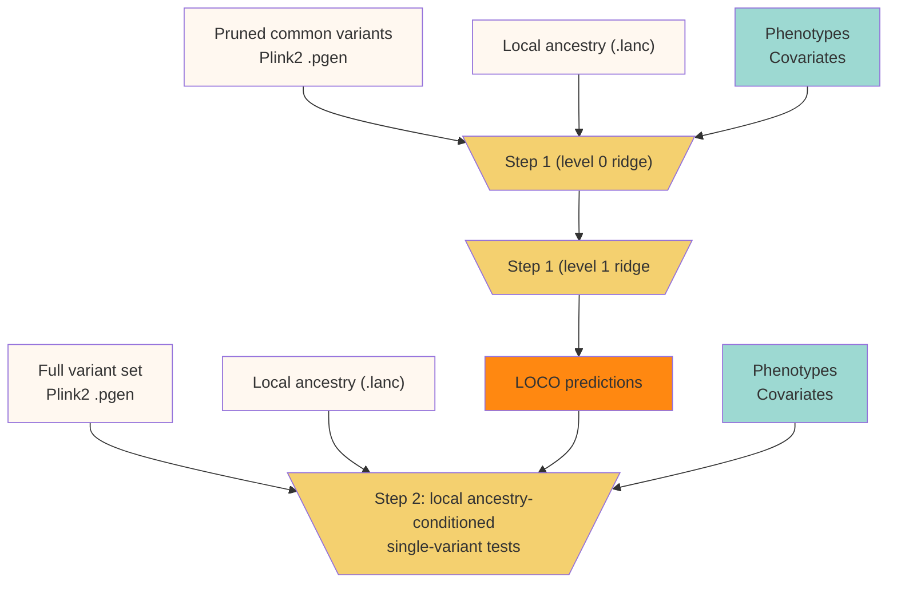

# Overview

**lagga** is a framework for conducting genome-wide association studies
in admixed individuals. Like [regenie](https://rgcgithub.github.io/regenie),
**lagga** uses whole-genome regression to capture polygenic effects and correct
for cryptic relatedness. Like [Tractor](https://atkinson-lab.github.io/Tractor-tutorial/),
**lagga** then calculates ancestry-specific effect estimates, conditioned
on local ancestry. We describe this two-step process in greater detail below.

